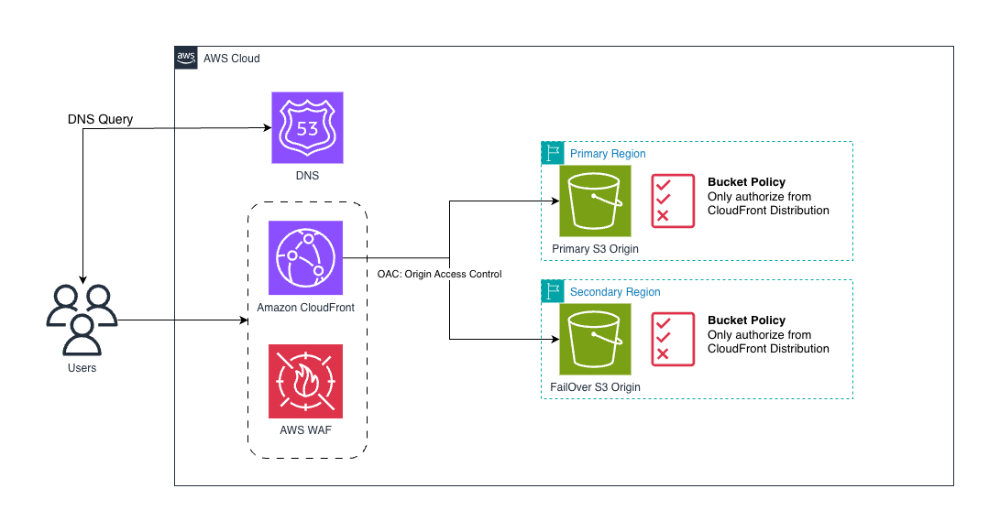
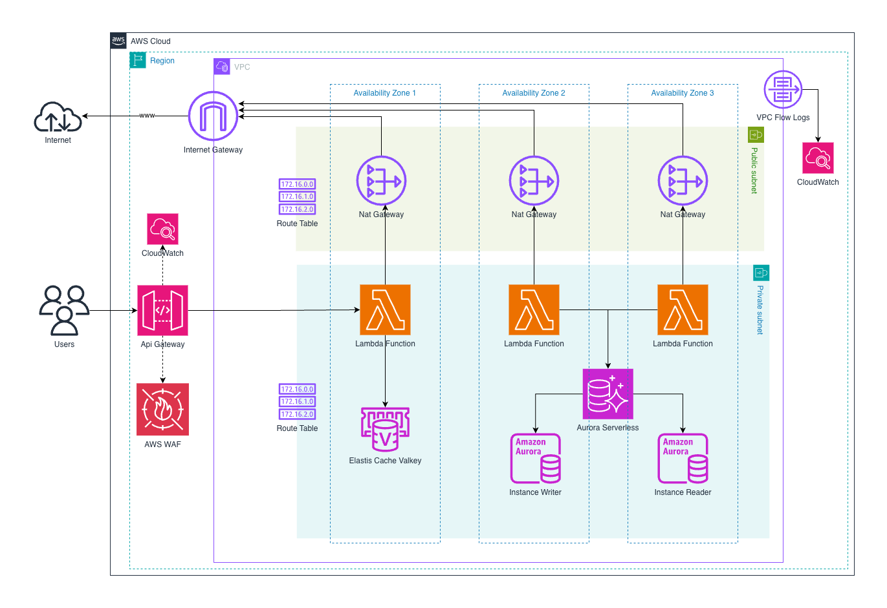

# Prueba Técnica – CloudOps AWS (Terraform)

Repositorio de **Infraestructura como Código (IaC)** para implementar una aplicación web **e-commerce de 3 capas** en AWS (**Frontend**, **Backend** y **Datos**) con foco en **alta disponibilidad, escalabilidad, seguridad y costo-eficiencia**, usando componentes **serverless** y servicios administrados.


## Arquitectura

### Vista FrontEnd


### Vista Backend


---


## Estimación de costos

En el directorio `assets/` se incluye el archivo **`Estimacion.pdf`**, el cual contiene la **estimación de costos de la arquitectura propuesta**, generada utilizando **AWS Pricing Calculator**.

Este documento detalla:
- Servicios AWS considerados en la solución (Frontend, Backend, Datos y Networking).
- Supuestos de uso (tráfico, requests, almacenamiento, cómputo).
- Estimación mensual aproximada de costos.
- Enfoque en costo-eficiencia usando servicios administrados y serverless.

📄 **Ruta del archivo**:  
`assets/Estimacion.pdf`

---

## ¿Qué despliega?

- **Frontend**: hosting estático en **S3** servido por **CloudFront** (con **OAC**), con logs opcionales a un bucket dedicado.
- **Backend**: **API Gateway HTTP API** + **AWS Lambda** (patrón microservicios por “servicio”).
- **Datos**:
  - **RDS** (relacional administrado, pensado para productos/usuarios/órdenes).
  - **Valkey** (capa de caché tipo Redis compatible) para reducir latencia y costo en picos.
- **Red**: VPC multi-AZ con subnets públicas/privadas, NAT, endpoints y Flow Logs (según configuración del módulo).
- **DNS**: **Route 53** (hosted zone) + registros (A/alias para CloudFront y CNAMEs adicionales).

---

## Estructura del repositorio

```text
.
├── environments/
│   └── prod/                 # Único environment en este repo (producción)
│       ├── backend.tf         # provider + backend (comentado como ejemplo)
│       ├── main.tf            # composición (root module)
│       ├── variables.tf       # variables + locals (servicios, records, tags)
│       └── terraform.tfvars   # valores por ambiente
├── modules/
    ├── api-lambda/            # API Gateway + Lambdas (multi-servicio)
    ├── cloudfront-oac/        # CloudFront + Origin Access Control
    ├── networking/            # VPC, subnets, NAT, endpoints, flow logs, etc.
    ├── rds/                   # RDS (MySQL/Postgres, según variables)
    ├── route53/               # Hosted zone + (opcional) ACM para el dominio
    ├── route53-records/       # Registros DNS dentro de un hosted zone existente
    ├── s3-frontend/           # Bucket S3 para hosting estático del FE
    └── valkey/                # Valkey (Redis compatible) administrado
```

---

## Módulos (qué hace cada uno)

> Cada módulo tiene su README propio con inputs/outputs y ejemplos.

- `modules/networking`  
  Crea VPC multi-AZ, subnets públicas/privadas, ruteo, (NAT por AZ), endpoints y controles básicos de red.
- `modules/s3-frontend`  
  Bucket S3 para contenido estático (index/error document, versioning, encryption, logs).
- `modules/cloudfront-oac`  
  Distribution CloudFront con **Origin Access Control** para servir el contenido del bucket S3 de forma privada/segura (TLS + custom domain).
- `modules/api-lambda`  
  Despliega múltiples Lambdas (una por entrada en `services`) detrás de **API Gateway HTTP API**, con:
  - IAM por función
  - tracing activo
  - DLQ en SQS
  - despliegue del código desde **S3** (`s3_bucket` + `s3_key`)
- `modules/rds`  
  RDS administrado (subnet group, security group, encryption, backups/maintenance según variables del módulo).
- `modules/valkey`  
  Cluster/replication group Valkey (Redis compatible) en subnets privadas, con cifrado y HA según configuración.
- `modules/route53`  
  Hosted zone para el dominio y (si está habilitado en el módulo) soporte para certificado ACM.
- `modules/route53-records`  
  Registros DNS desacoplados de la creación del hosted zone (patrón “zone vs. records”).

---

## Environments

Este repo trae **solo `prod`**:

- `environments/prod`

Para agregar más ambientes (ej. `dev`, `uat`):
1. Copia `environments/prod` a `environments/dev` (o `uat`).
2. Ajusta `terraform.tfvars`, `locals` y naming.
3. Usa backend/state separado por environment (recomendado).

---

## Pre-requisitos

- Terraform `>= 1.13.0`
- AWS CLI configurado (perfil/credenciales con permisos suficientes)
- (Opcional) `tflint`, `checkov`, `tfsec` para validaciones

---

## Variables principales (prod)

En `environments/prod/terraform.tfvars`:

```hcl
project     = "jfc"
environment = "prod"
region      = "us-east-1"
```

En `environments/prod/variables.tf` se definen:
- `records`: DNS (ej. `www` como alias a CloudFront)
- `backend_services`: definición de microservicios para Lambdas (path/runtime/handler/zip_key/auth)
- `tags`: etiquetas estándar (Project, Environment, Owner, CostCenter, etc.)

---

## Cómo desplegar (prod)

> Comandos desde la raíz del repo.

1) Ir al environment:

```bash
cd environments/prod
```

2) Inicializar:

```bash
terraform init
```

3) Plan:

```bash
terraform plan -out tfplan
```

4) Apply:

```bash
terraform apply tfplan
```

---

## Backend / State remoto (recomendado)

En `environments/prod/backend.tf` hay un ejemplo de backend S3 **comentado**.  
Para producción real, se recomienda:

- S3 bucket para state (con versioning + encryption)
- DynamoDB para lock
- Separar `key` por environment

Ejemplo (descomentar y ajustar):

```hcl
terraform {
  backend "s3" {
    bucket         = "my-terraform-states"
    key            = "prod/terraform.tfstate"
    region         = "us-east-1"
    encrypt        = true
  }
}
```

---

## Validaciones (lint / security)

Desde la raíz:

```bash
terraform -chdir=environments/prod init -backend=false
terraform -chdir=environments/prod validate
terraform fmt -recursive

tflint --init
tflint

checkov -d ./
tfsec ./
```

---

## Observabilidad (qué se considera)

- Logs de Lambda en CloudWatch (por defecto con `AWSLambdaBasicExecutionRole`).
- Tracing activo en Lambdas (`tracing_config { mode = "Active" }`).
- DLQ para fallos (SQS).
- En el modulo `networking` Flow Logs a CloudWatch según el módulo.

---

## Seguridad (puntos clave)

- CloudFront + OAC para acceso privado al bucket S3 del frontend.
- Recursos de datos en subnets privadas (RDS/Valkey) con Security Groups acotados.
- IAM por función Lambda (principio de mínimo privilegio ampliable).
- Cifrado en reposo (S3/RDS/Valkey) según configuración de cada módulo.

---

## Notas / mejoras futuras

- Separar la creación de buckets “globales” (`buckets-pragma-logs`, `buckets-pragma-lambdas`) en un módulo/base común.
- Añadir WAF (CloudFront/API Gateway) y rate limiting.
- Añadir GitHub Actions para `fmt/validate/tflint/tfsec/checkov` + plan/apply por ambiente.
- Parametrizar dominio (`pragma-ev.com`) y records para que sean 100% reutilizables.
